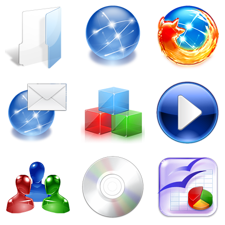
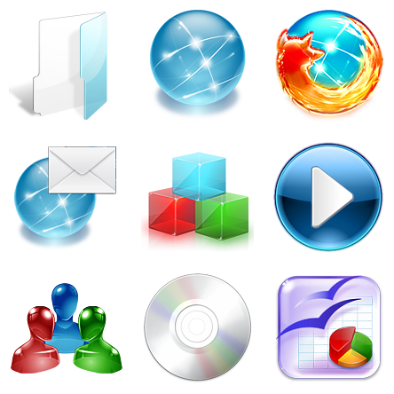
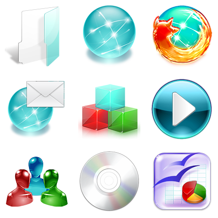
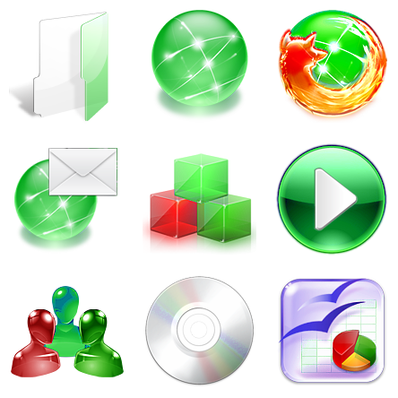
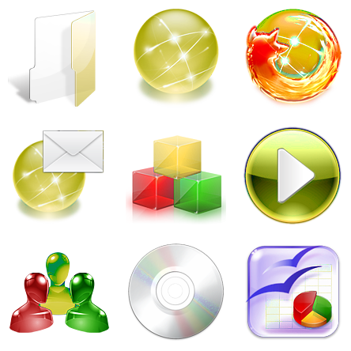
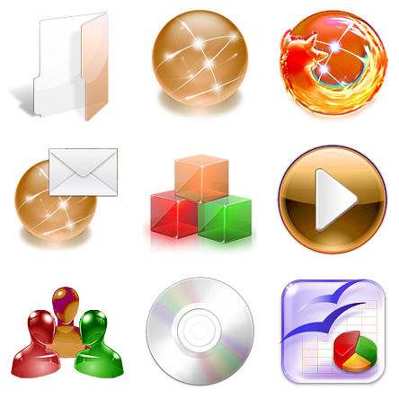
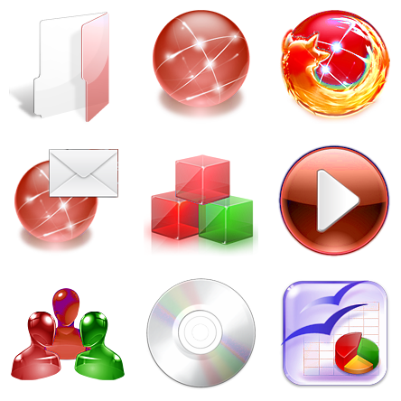
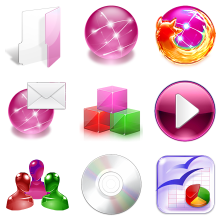
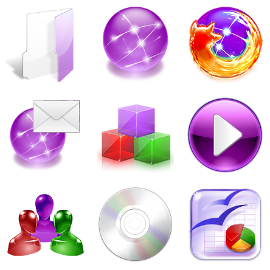

# Crystal Remix icon theme — color variants

A fork of [dangvd/crystal-remix-icon-theme](https://github.com/dangvd/crystal-remix-icon-theme) that adds a build tool for generating the whole theme in any accent color.

Crystal Remix is a Crystal icon theme for modern Linux desktop environments, created from KDE 3's Crystal Project and Crystal Clear icon themes. The icons are detailed 3D raster PNGs, so the color variants are not produced by swapping hex codes the way a flat SVG theme would. Instead the tool isolates the Crystal blue in HSV space and rotates only its Hue, leaving Saturation and Value untouched so the glass gradients, specular highlights and drop shadows survive exactly as the original artist drew them.

## Color variants

Every variant is generated from the same source icons. Blue is the original theme.

| Blue *(original)* | Cyan | Teal |
| :---: | :---: | :---: |
|  |  |  |
| `./build.sh blue` | `./build.sh cyan` | `./build.sh teal` |

| Green | Yellow | Orange |
| :---: | :---: | :---: |
|  |  |  |
| `./build.sh green` | `./build.sh yellow` | `./build.sh orange` |

| Red | Pink | Purple |
| :---: | :---: | :---: |
|  |  |  |
| `./build.sh red` | `./build.sh pink` | `./build.sh purple` |

Any other color works too — see [custom colors](#custom-colors) below.

Notice what stays put in the previews: the Firefox flame, the red and green cubes, the silver disc and the spreadsheet keep their original colors. Nothing is filtered by filename; the mask simply does not match them.

## Installing

### The original blue theme

```sh
chmod +x ./install.sh
./install.sh
```

### One or more color variants

`build.sh` builds a variant and installs it in one step. It creates its own Python environment on first run, so there is nothing to install by hand beyond `python3`.

```sh
chmod +x ./build.sh

./build.sh --list                  # show the available colors
./build.sh red                     # build and install a single variant
./build.sh red green purple        # several at once
./build.sh all                     # every color
```

Each variant is generated in a temporary directory, installed, and then deleted, so no build output is left next to the repository. A full `all` run never needs room for more than one variant at a time.

Themes install to `~/.local/share/icons/crystal-remix-<color>/`, or system-wide under `/usr/share/icons/` when run as root. Finally, pick the theme in the icon section of your System Settings / Control Panel / Tweaks. Each variant appears under its own name, such as *Crystal Remix Red*, so you can install several and switch between them.

To remove a variant later, delete its directory:

```sh
rm -rf ~/.local/share/icons/crystal-remix-red
```

### Options

| Option           | Meaning                                                    |
| ---------------- | ---------------------------------------------------------- |
| `--work-dir DIR` | where the temporary build happens (defaults to `$TMPDIR`)  |
| `--jobs N`       | number of worker processes (defaults to all CPU cores)     |
| `--list`         | print the available colors                                 |

If you would rather keep the generated theme directory instead of installing it, call the generator directly and pass `--dest-parent`:

```sh
.venv/bin/python tools/generate_theme.py --color-name Red --dest-parent ~/themes
```

## Custom colors

`build.sh` covers the nine presets. For anything else, call the generator directly with a target hue in degrees (the `.venv` it uses is created by the first `build.sh` run):

```sh
.venv/bin/python tools/generate_theme.py --color-name Ocean --hue 195
.venv/bin/python tools/generate_theme.py --color-name Crimson --hue-shift 150
```

`--hue` sets where the Crystal blue band lands on the color wheel; `--hue-shift` applies a raw offset instead. `--sat-scale` and `--val-scale` are available if a color needs a nudge in intensity.

The generator writes the variant to a directory next to this repository and leaves it there; install it with its own script:

```sh
cd ../Crystal-Remix-Ocean && ./install.sh
```

Before committing to a full build you can preview the math on a single directory:

```sh
.venv/bin/python tools/test_recolor.py --dir 128x128/actions --hue 0
```

That writes a before/after contact sheet to `tools/preview/`.

## How the recoloring works

The whole theme is processed, not just folders, so the accent is consistent across `actions`, `apps`, `devices`, `mimetypes` and the rest. Of the 3749 icons, roughly 3082 contain Crystal blue and are recolored; the remaining 667 contain none and are copied byte for byte.

- **Hue only.** Saturation and Value are never written, so brightness and gloss are mathematically unchanged.
- **A soft mask, not a hard range.** Pixels are weighted continuously across hue 195-225 degrees with a 15 degree feather, so anti-aliased edges do not develop color seams at small icon sizes.
- **Alpha is preserved exactly.** Icons are read with `cv2.IMREAD_UNCHANGED`, the alpha channel is split off before any color conversion and reattached untouched, and pixels outside the mask keep their original bytes.
- **Lossless output.** PNGs are re-encoded at maximum compression with no quality loss.

A full build takes a couple of seconds; the work is spread across all CPU cores.

## Repository layout

| Path                      | Contents                                              |
| ------------------------- | ----------------------------------------------------- |
| `22x22` … `128x128`       | the icon theme itself, in the original blue           |
| `build.sh`                | builds color variants and installs them               |
| `install.sh`              | installs the theme in the current directory           |
| `tools/generate_theme.py` | the generator: copy, recolor, rewrite metadata        |
| `tools/recolor.py`        | the HSV mask and hue rotation                         |
| `tools/test_recolor.py`   | before/after contact sheets for checking the mask     |
| `tools/make_previews.py`  | regenerates the preview images in this README         |
| `docs/previews`           | the variant images shown above                        |

## Credits and license

Original author: Everaldo Coelho (<https://en.wikipedia.org/wiki/Everaldo_Coelho>).
Adapted for modern Linux desktop environments by Viet Dang (Đặng Việt Dũng), whose [upstream repository](https://github.com/dangvd/crystal-remix-icon-theme) is the base for this fork ([releases](https://github.com/dangvd/crystal-remix-icon-theme/releases)).

GNU Lesser General Public License (LGPL).

### References

The original posts from Everaldo are no longer available, but the two Crystal icon sets can still be found online:

- [Crystal Project icon set](http://www.softicons.com/system-icons/crystal-project-icons-by-everaldo-coelho)
- [Crystal Clear icon set](http://www.softicons.com/system-icons/crystal-clear-icons-by-everaldo-coelho)
